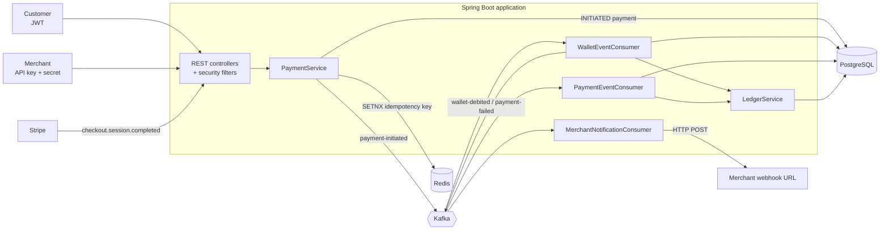
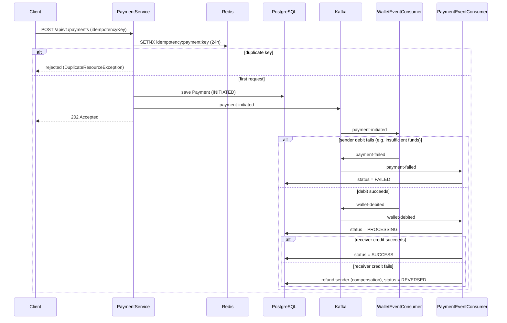
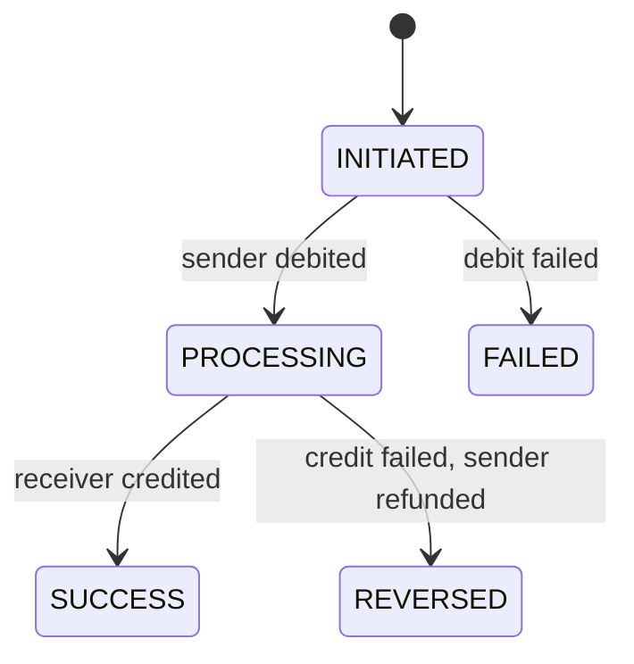

# Distributed Payment

An event-driven **wallet-to-wallet payment platform** built with Spring Boot. Payments are accepted instantly (`202 Accepted`) and settled asynchronously through a **Kafka-choreographed saga** with automatic compensation. Redis and PostgreSQL work together to make requests **idempotent**, wallets are protected against concurrent updates, and every balance change is recorded in a **ledger**. Customers authenticate with JWT, merchants with API keys, and wallets can be topped up through Stripe Checkout.

## Features

- **Async payment saga over Kafka**: debit sender → credit receiver, with a compensating refund if the credit fails.
- **Two-layer idempotency**: an atomic Redis `SETNX` lock (24 h TTL) gives a sub-millisecond fast-fail, and a `UNIQUE` constraint on `idempotency_key` in PostgreSQL is the durable backstop.
- **Concurrency-safe wallets**: `@Version` optimistic locking on the wallet row, plus a `SELECT … FOR UPDATE` lookup for pessimistic locking.
- **Ledger**: every debit and credit is written as a `ledger_entries` row inside the same transaction as the balance change (`Propagation.MANDATORY`).
- **Payment state machine**: `INITIATED → PROCESSING → SUCCESS`, with `FAILED` and `REVERSED` for the failure paths.
- **Dual authentication**: JWT bearer tokens for customers/admins, and `X-API-KEY` / `X-API-SECRET` for merchant server-to-server calls (secrets stored BCrypt-hashed and shown once at onboarding).
- **Role-based access**: `CUSTOMER`, `MERCHANT` and `ADMIN` roles enforced with `@PreAuthorize`.
- **Stripe wallet top-ups**: Checkout sessions plus a signature-verified webhook that credits the wallet.
- **Merchant webhooks**: merchants receive an HTTP callback when a payment to them is processed.

## Architecture



### Payment saga



### Payment states



### Kafka topics

| Topic | Producer | Consumer (group) | Purpose |
|---|---|---|---|
| `payment-initiated` | `PaymentService` | `WalletEventConsumer` (`wallet-service-group`) | Debit the sender |
| `wallet-debited` | `WalletEventConsumer` | `PaymentEventConsumer` (`payment-service-group`), `MerchantNotificationConsumer` (`merchant-notification-group`) | Credit the receiver / notify the merchant |
| `payment-failed` | `WalletEventConsumer` | `PaymentEventConsumer` (`payment-service-group`) | Mark the payment `FAILED` |

Events are keyed by `paymentId`, so all events for one payment land in the same partition and stay ordered.

## Tech stack

| Area | Technology |
|---|---|
| Language / framework | Java, Spring Boot (Web, Validation) |
| Security | Spring Security, JWT (jjwt, HS256), BCrypt, custom API-key filter |
| Persistence | Spring Data JPA, PostgreSQL (`NUMERIC(18,4)` money columns) |
| Messaging | Apache Kafka (Spring Kafka) |
| Cache / locks | Redis (`RedisTemplate`, `setIfAbsent` with TTL) |
| Payments | Stripe Java SDK (Checkout + webhooks) |
| Mapping / boilerplate | MapStruct, Lombok |

## Project structure

```
distributed-payment/
└── src/main/java/com/distributed_payment/
    ├── DistributedPaymentApplication.java
    ├── auth/         # register / login, DTOs, MapStruct mapper
    ├── customer/     # profile + admin customer management
    ├── payment/      # PaymentController, PaymentService, IdempotencyService,
    │                 # StripeService, StripeWebhookController, PaymentEventConsumer
    ├── wallet/       # Wallet entity (@Version), repository, WalletEventConsumer, events
    ├── ladger/       # LedgerEntry + LedgerService (double-entry style records)
    ├── mercent/      # merchant onboarding, API keys, webhook notification consumer
    ├── security/     # SecurityConfig, JwtService, JWT + API-key filters, User, Role
    └── exception/    # shared exceptions
```

## Database schema

| Table | Highlights |
|---|---|
| `users` | Unique email, BCrypt password hash, `role`, `enabled` flag (used for soft-deactivation) |
| `customers` | One-to-one with `users` |
| `merchants` | One-to-one with `users`, unique `api_key`, hashed `api_secret`, `webhook_url`, `status` (`ACTIVE`/`SUSPENDED`) |
| `wallets` | `owner_id` + `owner_type` (`CUSTOMER`/`MERCHANT`), `balance`, `currency`, `version` |
| `payments` | UUID id, sender/receiver wallet, `amount`, `status`, **unique `idempotency_key`**, `error_message` |
| `ledger_entries` | `wallet_id`, `payment_id`, `entry_type` (`DEBIT`/`CREDIT`), `amount`, indexed by wallet |

## API reference

Base path: `/api/v1`. Everything except `/auth/**` requires authentication.

| Method | Endpoint | Auth | Description |
|---|---|---|---|
| `POST` | `/auth/register` | Public | Create a user and customer profile, returns a JWT |
| `POST` | `/auth/login` | Public | Returns a JWT (`token`, `tokenType`, `expiresInMs`) |
| `GET` | `/customers/profile` | `CUSTOMER` | Current customer's profile |
| `PUT` | `/customers/profile` | `CUSTOMER` | Update name, phone, address |
| `GET` | `/customers` | `ADMIN` | List all customers |
| `DELETE` | `/customers/{id}` | `ADMIN` | Deactivate a customer (disables the user) |
| `POST` | `/payments` | `CUSTOMER` | Initiate a payment, returns `202 Accepted` |
| `POST` | `/merchants/onboard` | Logged-in user | Create a merchant; returns the API key and secret **once** |
| `POST` | `/webhooks/stripe` | Stripe signature | Credits a wallet when a top-up checkout completes |

### Example

```bash
# 1. Register (returns a JWT)
curl -X POST http://localhost:8080/api/v1/auth/register \
  -H "Content-Type: application/json" \
  -d '{"fullName":"Asha Rao","email":"asha@example.com","password":"secret123","phone":"9999999999","address":"Bangalore"}'

# 2. Initiate a payment
curl -X POST http://localhost:8080/api/v1/payments \
  -H "Authorization: Bearer <token>" \
  -H "Content-Type: application/json" \
  -d '{
        "senderId": 1,   "senderType": "CUSTOMER",
        "receiverId": 2, "receiverType": "MERCHANT",
        "amount": 25.50, "currency": "USD",
        "idempotencyKey": "order-1001-attempt-1"
      }'
```

The response is a `Payment` in `INITIATED` state. Poll or listen for the final state (`SUCCESS`, `FAILED` or `REVERSED`). Retrying with the same `idempotencyKey` will not create a second payment.

## Getting started

### Prerequisites

- Java 17+ and Maven or Gradle (whichever the project uses)
- PostgreSQL, Redis and Kafka running locally (Docker is the easiest way)
- Optional: a Stripe account and its CLI, for top-up testing

### Configuration

Set these in `src/main/resources/application.yml` or as environment variables. Names other than the Stripe ones are the standard Spring Boot properties.

```yaml
spring:
  datasource:
    url: jdbc:postgresql://localhost:5432/distributed_payment
    username: <db-user>
    password: <db-password>
  data:
    redis:
      host: localhost
      port: 6379
  kafka:
    bootstrap-servers: localhost:9092

stripe:
  api:
    key: ${STRIPE_API_KEY}
  webhook:
    secret: ${STRIPE_WEBHOOK_SECRET}
```

Create the tables from the SQL scripts (users, customers, wallets, ledger_entries, payments, merchants) and make sure the three Kafka topics exist (or that auto-creation is enabled).

### Run

```bash
./mvnw spring-boot:run        # or: ./gradlew bootRun
```

To test top-ups locally, forward Stripe events to the webhook:

```bash
stripe listen --forward-to localhost:8080/api/v1/webhooks/stripe
```

## Design notes

- **Why a saga?** Wallet debits and credits are handled in separate steps driven by Kafka events, so there is no distributed transaction. Failures are handled with a compensating refund rather than a rollback.
- **Why `202 Accepted`?** The request only records intent and publishes an event. The outcome is reached asynchronously.
- **Why Redis and a DB constraint?** Redis rejects duplicates in under a millisecond without touching the database, while the unique constraint guarantees correctness even if Redis loses the key.
- **Ledger in the same transaction:** `LedgerService.recordEntry` requires an existing transaction, so a balance change and its ledger row commit or roll back together.
- **Merchant credentials:** `apiKey` is a `pk_…` identifier and `apiSecret` an `sk_…` random value. Only a BCrypt hash of the secret is stored.

## Known limitations and roadmap

These are known gaps in the current version:

- [ ] **Take the sender from the authenticated user.** `senderId` currently comes from the request body, so it must be validated against the caller's own wallet.
- [ ] **Move the JWT signing secret out of source code** into an environment variable or secret manager.
- [ ] **Transactional outbox.** The Kafka publish happens inside the DB transaction without an outbox, so a failure between the two can leave a payment stuck in `INITIATED` or an event without a row.
- [ ] **Idempotent consumers.** Kafka delivers at least once, so consumers should skip payments they have already processed (the ledger has `existsByPaymentIdAndEntryType` for this).
- [ ] **Idempotency lock cleanup.** If a request fails after the Redis lock is set, retries are rejected until the 24 h TTL expires. Store the result or release the key on failure, and return the original payment for a duplicate.
- [ ] **Allow the Stripe webhook through the security chain** (`permitAll` for `/api/v1/webhooks/stripe`, since it authenticates by signature) and de-duplicate by Stripe session id.
- [ ] **Merchant webhooks:** trigger on `SUCCESS` rather than on `wallet-debited`, and add retries with backoff, signing and a dead-letter queue.
- [ ] Dead-letter topics and retries for Kafka consumers.
- [ ] Rate limiting, fraud/velocity checks and audit logging.
- [ ] Integration tests with Testcontainers (PostgreSQL, Kafka, Redis).
- [ ] Dockerfile and `docker-compose.yml` for one-command startup.

## Author

**Anshu Kumar**: [LinkedIn](https://www.linkedin.com/in/anshu-kumar-654199197/) · [GitHub](https://github.com/Anshu9623019)
